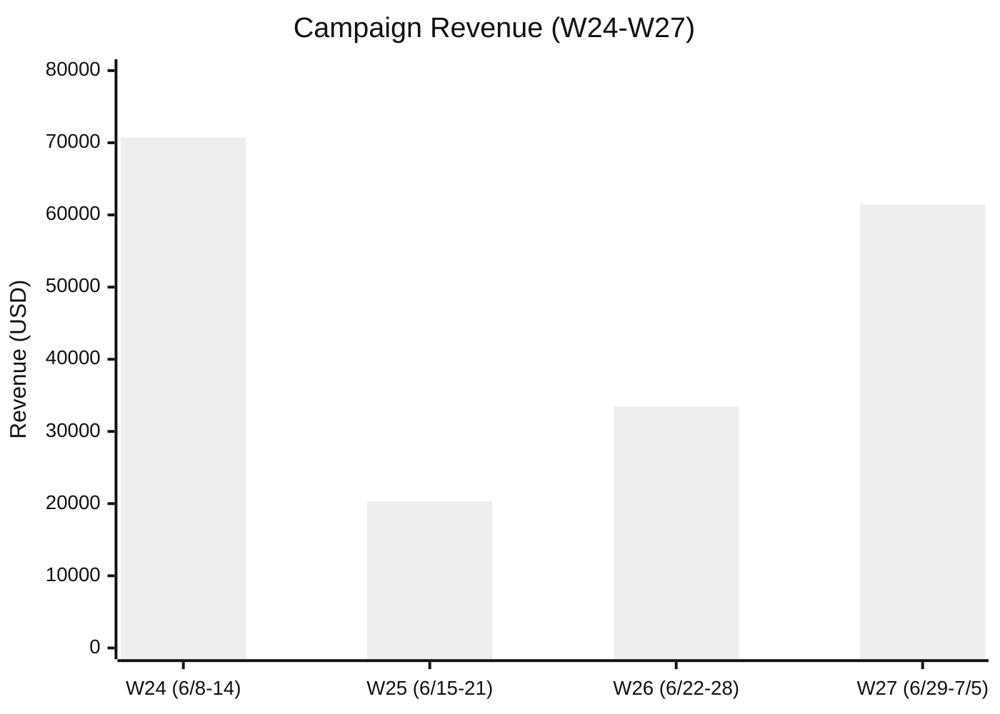
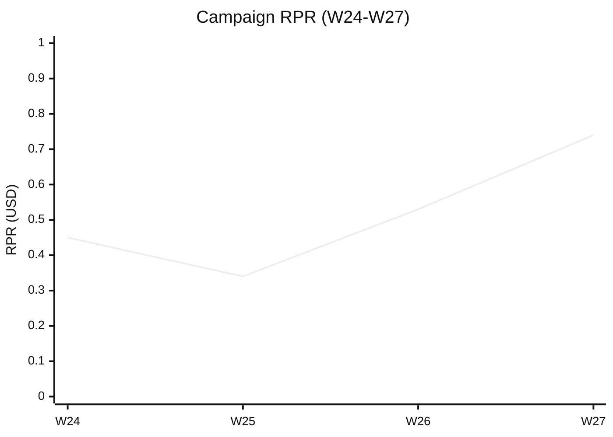

> 周窗口：2026-06-29 ~ 2026-07-05（ISO Week 27）｜生成：2026-07-06 US/Eastern｜数据：Klaviyo（RitFit 账户）｜⚠️ 营销活动日历不可用（lark-cli 未安装）、Shopify GMV 未拉取
> ⚠️ 注意：当前 Klaviyo MCP 连接 RitFit 账户（info@ritfitsports.com），非 KH 独立账户。报告数据显示 RitFit 品牌邮件表现。

# 一、核心要点

## 本周数据总结
- **EDM Campaign 收入 $61,451，WoW +83.5%**：独立日大促 7.1 放量至 38K 全量用户，单封贡献 $46,653，占 Campaign 总收入 76%
- **Flow 总收入约 $231,001**：Welcome Series 贡献最高 $54,493，Browse Abandonment $50,874 紧随其后，AC $46,839 排第三
- **Campaign 发送量 +32.8%**：本周 4 封 vs 上周 3 封，新增会员预览 6.30 + 品类邮件 7.3，周末 7.5 追加 Send
- **Flow 零发送告警**：HIBS Hot (R5Zf5N) 和 F1 WC Prediction (WKGRFP) 本周活跃但零发送，触发配置需排查
- **7.5 Spend more 周日深夜发送**：38K 受众仅归因 <12h，当前收入 $2,246 严重偏低，T+7 窗口至下周日

## 收入快照

| KPI | 本周 W27 | 对比周 W26 | WoW |
|---|---|---|---|
| EDM Campaign 收入 | $61,450.57 | $33,492.18 | +83.5% |
| EDM Flow 收入 | ~$231,001 | N/A（未拉取） | N/A |
| EDM 总收入 | ~$292,452 | N/A | N/A |
| Campaign 收件人 | 83,453 | 62,841 | +32.8% |
| Campaign RPR | $0.74 | $0.53 | +38.4% |
| Campaign 转化数 | 68 | 60 | +13.3% |
| EDM 占整店收入比 | ⚠️ Shopify GMV 未拉取 | — | — |

## 近四周趋势

### EDM Campaign 收入趋势（近四周，单位 USD）

W24 世界杯预测活动推高收入至 $70.7K，W25 缩量至 $20.3K，W26 回升至 $33.5K，W27 独立日大促拉升至 $61.5K — 接近 W24 峰值水平。

### Campaign 单收件人收入趋势（RPR，近四周）

RPR 连续两周上升：W25 $0.34 → W26 $0.53 → W27 $0.74。本周 RPR 提升主要受 7.1 全量促销（RPR $1.23）+ 6.30 会员预览（RPR $1.40）驱动，但 7.5 新增发送（RPR $0.06）大幅摊薄。

---

# 二、数据诊断与行动建议

## 2.1 Campaign 活动邮件

### 行业基准（促销邮件 / Promo）

| 指标 | 健康 🟢 | 观察 🟡 | 告警 🔴 |
|---|---|---|---|
| Open Rate | > 30% | 20-30% | < 20% |
| Click Rate | > 1.2% | 0.6-1.2% | < 0.6% |
| CTOR | > 4% | 2.5-4% | < 2.5% |
| CVR | > 0.08% | 0.04-0.08% | < 0.04% |
| RPR | > $0.50 | $0.20-$0.50 | < $0.20 |
| Unsub Rate | < 0.3% | 0.3-0.6% | >= 0.6% |

### 本周发送邮件数据

| 邮件名称 | 发送日 | 受众 | 收件人 | 打开率 | 点击率 | CTOR | CVR | RPR | AOV | 收入 | 退订率 | 退信率 | Web View |
|---|---|---|---|---|---|---|---|---|---|---|---|---|---|
| 6.30 sale preview for members | 6/30 Tue | Active Members · L2-4 | 3,506 | 68.67% 🟢 | 3.29% 🟢 | 4.79% 🟢 | 0.572% 🟢 | $1.40 🟢 | $213.48 | $4,910 | 0.229% 🟢 | 0.314% 🟢 | [View](https://www.klaviyo.com/campaign/01KW91FG8JDN4FRGC51P3N89W5/web-view) |
| 7.1 The sale is live | 7/1 Wed | 180D Active | 38,059 | 63.86% 🟢 | 1.47% 🟢 | 2.30% 🟡 | 0.097% 🟢 | $1.23 🟢 | $1,196.24 | $46,653 | 0.126% 🟢 | 0.289% 🟢 | [View](https://www.klaviyo.com/campaign/01KWBJZWPB9H44NXSCXSRQB0HS/web-view) |
| 7.3 Racks built to last | 7/3 Thu | Machine Engaged 180d | 3,444 | 47.51% 🟢 | 1.89% 🟢 | 3.98% 🟢 | 0.146% 🟢 | $2.22 🟢 | $1,528.14 | $7,641 | 0.116% 🟢 | 0.261% 🟢 | [View](https://www.klaviyo.com/campaign/01KWJSSHPZGMXZP902ASDQXFDM/web-view) |
| 7.5 Spend more, get more | 7/5 Sun | 180D Active | 38,444 | 44.24% 🟢 | 0.51% 🟡 | 1.14% 🔴 | 0.003% 🔴 | $0.06 🔴 | $2,246.47 | $2,246 | 0.057% 🟢 | 0.265% 🟢 | [View](https://www.klaviyo.com/campaign/01KWTHEDK8HNSP0A73W6GXWM21/web-view) |

> ⚠️ 数据仍在更新：7.5 Spend more, get more 发送于周日（7/5 22:30 EDT），T+7 归因窗口截至 7/12，收入/CVR/RPR 数据将持续回填，当前数值严重偏低属正常。

### 素材评分

| 邮件 | 标题行 | 预览文本 | 首屏 | CTA | Offer 清晰度 | 受众匹配 | 信息层级 | 总分/35 | 等级 |
|---|---|---|---|---|---|---|---|---|---|
| 6.30 sale preview | 4 | 5 | 4 | 4 | 5 | 5 | 4 | 31 | 🟢 |
| 7.1 The sale is live | 4 | 4 | 4 | 3 | 4 | 4 | 3 | 26 | 🟡 |
| 7.3 Racks built to last | 4 | 4 | 4 | 4 | 4 | 5 | 4 | 29 | 🟢 |
| 7.5 Spend more, get more | 3 | 4 | 3 | 3 | 4 | 3 | 3 | 23 | 🟡 |

> ⚠️ 数据仍在更新：7.5 Spend more, get more 发送于周日（7/5 22:30 EDT），T+7 归因窗口截至 7/12，收入/CVR/RPR 数据将持续回填，当前数值偏低属正常。

### 问题与建议

**第一层：问题诊断表**

| # | 问题描述 | 根因 & 活动影响 | 优先级 | ETA |
|---|---|---|---|---|
| 1 | 7.1 The sale is live CTOR 仅 2.30%（🟡 观察区），在所有 Campaign 中垫底 | 38K 大规模发送拉低整体参与度（180D Active 包含大量低活跃用户）。独立日大促首日邮件内容需要更强的 Offer 兑现感。活动影响：大促放量必然导致 CTOR 摊薄，属预期内 | P1 | 下次大促前 |
| 2 | 7.5 Spend more 周日深夜发送，CVR 0.003% / RPR $0.06 完全失效（排除延迟归因后仍偏低） | ① 周日 22:30 EDT 发送时间差；② 全量发送但邮件主题"Spend more"门槛过高，$2,000 门槛受众匹配度低（180D Active 包含大量低客单用户）；③ T+1 归因窗口仅数小时故严重偏低。活动影响：大促收尾追加 Send，非预期节奏内 | P0 | 本周内评估 |
| 3 | 6.30 会员预览表现优异（CVR 0.572% / RPR $1.40）但体量仅 3,506 人，规模过小 | L2-4 会员池仅为 3.5K，预览策略正确但触达面不足以支撑独立日预热效果。活动影响：大促预热机制有效但触达不足 | P2 | 下次大促 |

**第二层：行动清单表**

| 完成 | 行动描述 | 问题# | 类型 | 优先级 | ETA |
|---|---|---|---|---|---|
| [] | 7.5 Spend more 等待 T+7 完整归因窗口（7/12），下周一复查最终收入数据决定是否保留此 Send 节奏 | #2 | 🟡 | P0 | 7/13 |
| [] | 下次大促首日邮件增加动态内容块（用户最近浏览品类/加购商品），提升 CTOR 至 >3% | #1 | 🔶 | P1 | 下次大促 |
| [] | 将会员预览池从 L2-4 扩展至 L1-4（预计 +40% 触达），或在预览日追加一封面向 All Active 的 Sneak Peek | #3 | 🟡 | P2 | 7月底 |
| [] | 7.5 类追加 Send 评估引入分层策略：高客单用户（AOV>$500）发 Spend More，其余用户发通用折扣收尾 | #2 | 🔶 | P1 | 下次大促 |

---

## 2.2 自动化流程

### 核心流程数据（按收入排序）

| 流程名 | 本周收入 | 触达人数 | 转化数 | RPR | AOV | 健康状态 |
|---|---|---|---|---|---|---|
| New Email Welcome Series | $54,493 | 533 | 34 | $102.24 | $1,602.68 | 🟢 正常 |
| Browse Abandonment - Standard | $50,874 | 864 | 29 | $58.88 | $1,754.17 | 🟢 正常 |
| Abandoned Cart | $46,839 | 1,144 | 31 | $40.94 | $1,510.76 | 🟢 正常 |
| SMS Welcome Series with Discount | $31,103 | 236 | 13 | $131.79 | $2,394.04 | 🟢 正常 |
| Back In Stock Flow - Standard | $21,967 | 333 | 19 | $65.97 | $1,156.13 | 🟢 正常 |
| HIBS — Warm (72h) | $9,092 | 971 | 10 | $9.36 | $909.11 | 🟡 观察 |
| Abandoned Cart Reminder (SMS) | $7,153 | 157 | 4 | $45.56 | $1,788.27 | 🟢 正常 |
| Customer Thank You | $4,970 | 558 | 8 | $8.91 | $621.28 | 🟢 正常 |
| Omni OrderPointsIssued Flow | $3,380 | 12 | 4 | $281.67 | $845.00 | 🟢 正常（小样本） |
| Post-Purchase Cross-Sell by RFM | $1,006 | 126 | 2 | $7.98 | $502.78 | 🟡 观察 |
| Member Birthday Celebration | $125 | ~144 | 2 | ~$0.87 | ~$62.40 | 🔴 异常（极低转化） |
| HIBS — Cold (30d) | $0 | 189 | 0 | $0 | $0 | 🔴 异常（零转化） |
| Omni OrderRejected Flow | $0 | 4 | 0 | $0 | $0 | 🟢 通知型 |
| HIBS Hot (R5Zf5N) | $0 | 0 | 0 | — | — | ⚠️ 零发送 |
| F1 - WC Prediction Confirmation | $0 | 0 | 0 | — | — | ⚠️ 零发送 |

**邮件级明细（精选有收入或有异常的 Flow）：**

**New Email Welcome Series（3 封）：**
| 邮件序号 | 收件人 | CTOR | CVR | RPR | AOV | 收入 | 健康 |
|---|---|---|---|---|---|---|---|
| 第2封 W473E6 | 216 | 12.93% | 11.16% | $170.18 | $1,463.56 | $36,589 | 🟢 |
| 第3封 TntUsJ | 210 | 12.98% | 3.83% | $80.11 | $2,092.76 | $16,742 | 🟢 |
| 第1封 SKsRQ7 | 107 | 2.17% | 0.94% | $10.96 | $1,161.68 | $1,162 | 🟡 |

**Abandoned Cart（4 封）：**
| 邮件序号 | 收件人 | CTOR | CVR | RPR | AOV | 收入 | 健康 |
|---|---|---|---|---|---|---|---|
| SDdBp3 | 481 | 7.53% | 3.16% | $49.43 | $1,565.22 | $23,478 | 🟢 |
| VCZd5P | 355 | 6.16% | 2.83% | $50.88 | $1,801.02 | $18,010 | 🟢 |
| TpDhHi | 294 | 10.57% | 1.72% | $14.24 | $828.86 | $4,144 | 🟡 |
| VAdPHz | 14 | 0% | 7.14% | $86.14 | $1,206.01 | $1,206 | 🔶 小样本 |

**Browse Abandonment（2 封）：**
| 邮件序号 | 收件人 | CTOR | CVR | RPR | AOV | 收入 | 健康 |
|---|---|---|---|---|---|---|---|
| RYbNbW | 370 | 6.32% | 4.63% | $94.28 | $1,821.17 | $34,602 | 🟢 |
| WqyKrn | 494 | 6.14% | 1.83% | $33.01 | $1,627.16 | $16,272 | 🟢 |

### 问题与建议

**第一层：问题诊断表**

| # | 问题描述 | 根因 & 活动影响 | 优先级 | ETA |
|---|---|---|---|---|
| 1 | HIBS — Cold (30d) 189 人触达零转化，连续失效 | Cold 池用户已高度冷却（30d+ 无互动），当前内容/Offer 无法激活。活动影响：独立日大促期间用户注意力被 Campaign 抢占，Cold Flow 更难竞争 | P1 | 下周 |
| 2 | HIBS Hot (R5Zf5N) 和 F1 WC Prediction (WKGRFP) 本周零发送，状态为 live 但未触发 | HIBS Hot 触发条件可能过于严格或受众池耗尽；F1 WC Prediction 世界杯活动结束已无新增触发场景。活动影响：无直接关联 | P0 | 本周内 |
| 3 | Post-Purchase Cross-Sell by RFM RPR $7.98 / 仅 126 人触达，规模偏低 | 购后交叉销售触达面窄（仅高 RFM 用户），当前 Offer 吸引力不足。活动影响：大促期购后人群被 Campaign 覆盖，Cross-Sell 冗余 | P2 | 两周内 |
| 4 | Member Birthday Celebration 触达 144 人仅 $125 收入，CVR <1.4%，成本效率极低 | 生日邮件 Offer（疑似小额折扣或积分）无法驱动健身器材类高客单购买决策。小样本但趋势一致 | P2 | 月底 |

**第二层：行动清单表**

| 完成 | 行动描述 | 问题# | 类型 | 优先级 | ETA |
|---|---|---|---|---|---|
| [] | HIBS Hot (R5Zf5N) 和 F1 WC Prediction 排查触发条件：检查受众池是否枯竭、触发事件是否仍有效。若 F1 活动已结束则 Archive | #2 | 🟢 | P0 | 7/9 |
| [] | HIBS Cold (30d) 测试新 Offer：在 Cold 邮件中增加高感知折扣（如 15% off + Free Shipping）替代当前软性内容 | #1 | 🔶 | P1 | 7/13 |
| [] | Post-Purchase Cross-Sell 邮件增加互补产品推荐（基于购买品类动态匹配），替代当前固定推荐 | #3 | 🟡 | P2 | 7/20 |
| [] | Member Birthday 考虑从独立 Flow 迁移至月聚合 Campaign（降低维护成本，提高单次触达规模） | #4 | 🟡 | P2 | 7月底 |

---

## 2.3 订阅者

### 订阅者数据
- 当前活跃 Segments：10 个（含 HIBS_HighValue、HIBS_Cold、HIBS_Warm、Active Members L2-4、Engaged Non-Buyer、Cart Abandoner 180d、Machine Engaged 180d、Advanced & VIP Members 等）
- 本周 Campaign 总退订：82 人（退订率 0.098%，🟢 健康）
- 本周 Campaign 退信：232 人（退信率 0.278%，🟢 健康）
- 本周 Campaign 垃圾投诉：4 人（仅 7.1 邮件，投诉率 0.011%，🟢 健康）
- ⚠️ 总订阅者数未拉取（Segments API 不支持总量查询），建议通过 Klaviyo 后台或 Profiles API 获取

### 问题与建议

**第一层：问题诊断表**

| # | 问题描述 | 根因 & 活动影响 | 优先级 | ETA |
|---|---|---|---|---|
| 1 | 7.1 全量 Campaign（38K）退订 48 人虽在阈值内，但为本周最高单封退订量 | 全量发送覆盖低活跃用户，退订来自长沉默用户。活动影响：大促放量退订属预期损耗 | P2 | — |
| 2 | 180D Active 分群连续两周被高频触达（6.28 + 7.1 + 7.5 三封），用户疲劳度累计上升 | 独立日大促前后 8 天内 3 封 Campign，疲劳度评分估计 6/10（中度）。活动影响：大促节奏导致，需关注后续周退订加速 | P1 | 下周 |

**第二层：行动清单表**

| 完成 | 行动描述 | 问题# | 类型 | 优先级 | ETA |
|---|---|---|---|---|---|
| [] | 下周（大促后第一周）发送量控制在 1-2 封，给 180D Active 冷却期 | #2 | 🟢 | P1 | 7/7-7/13 |
| [] | 180D Active 分群建议拆分：Engaged 180d（高活跃）和 Dormant 180d（低活跃），大促期间差异化触达频次 | #2 | 🟡 | P2 | 7月底 |
| [] | 下周若发 Campaign，主题从硬促销转向品牌/内容向（如用户故事/UGC），恢复品牌温度 | #2 | 🟡 | P1 | 7/7-7/13 |

---

# 三、优先行动

## 本周 P0 待办

| 待办 | 负责方向 | KPI | ETA |
|---|---|---|---|
| 排查 HIBS Hot + F1 WC Prediction 零发送触发配置 | Flow 健康 | 恢复触发或 Archive | 7/9 |
| 7.5 Spend more 等待 T+7 归因数据，7/13 评估是否保留此 Send 策略 | Campaign 策略 | 最终 CVR >0.05% / RPR >$0.30 | 7/13 |
| 下周发送节奏控制在 1-2 封，内容转向品牌/价值向 | 用户疲劳管理 | 下周退订率 <0.15% | 7/7-7/13 |

## 下周计划
- 大促收尾周：降低 Campaign 频次，改用内容/品牌向邮件维持触达
- 启动 HIBS Cold 新 Offer A/B 测试（15% off vs 10% off + Free Shipping）
- 评估 7.5 Spend more 完整数据后决定是否调整大促收尾策略
