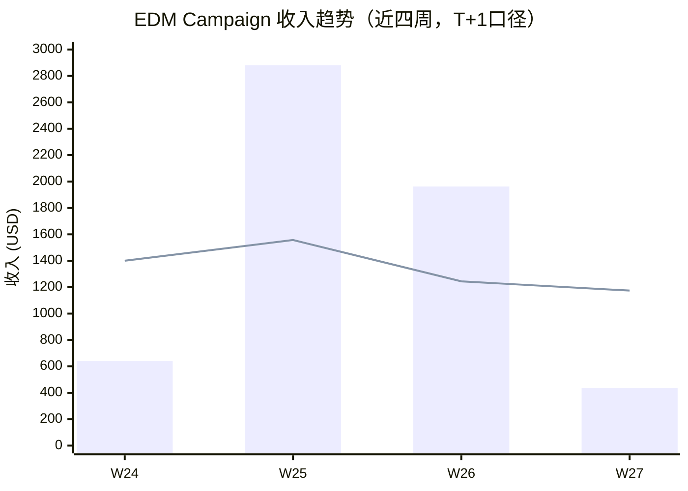
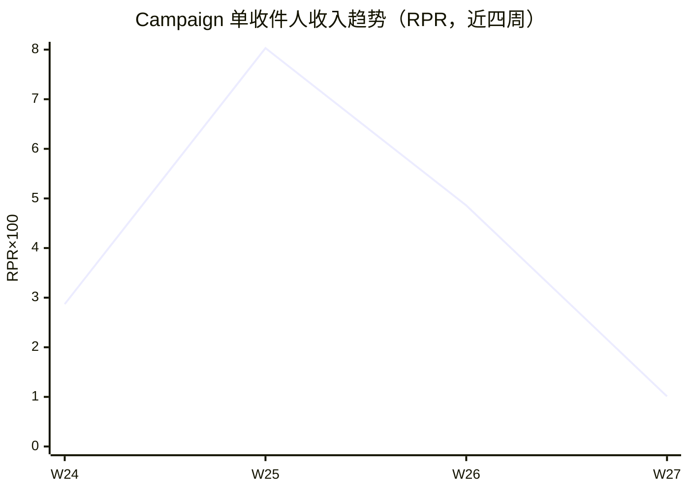

> 周窗口：2026-06-29 ~ 2026-07-05（ISO Week 27）｜生成：2026-07-07 US/Eastern｜数据：Klaviyo + Shopify + 营销活动日历
> ⚠️ T+1 早读：Flow 高客单转化 5-7 天内持续回填；Email 1（7/5 周日发送）数据尚未回传

# 一、核心要点

## 本周数据总结

- EDM 总收入 $1,611（WoW -45.6%），其中 Campaign $437、Flow $1,174，EDM 占整店 4.9%
- Campaign 发送量 43K 创新高，但转化仅 2 单（WoW -78%）— 本周无促销型 Campaign，全为内容/问卷型邮件
- Flow 端 Abandoned Cart V2 贡献 $1,044（占 EDM 总收入 65%），但 Flow 总收入 WoW -5.6% — W26 全量数据回填后 Welcome Series + Browse Abandonment 均有收入
- 整店 GMV $32,629（+8.0% WoW），EDM 占比 4.9% 较 W26 的 9.8% 大幅下降 — Summer Sale 首日（7/5）落在 W27 最后一天，活动增量尚未体现
- 7.1 Survey 打开率 21.46% 拖累整体，剔除后 Campaign 均开率 50.9%；Email 1（7/5 周日）T+7 窗口未满，数据仍为空

## 营销活动背景

| 活动 | 类型 | 周期 | 本周状态 | 活动 GMV 目标 |
|------|------|------|----------|-------------|
| Summer Sale | Sales | 7/5 ~ 7/19（15天） | 7/5 启动（W27 最后一天） | $125,000 |

Summer Sale 在 W27 最后一天（周日）启动，窗口内仅 1 天覆盖。W26 无大促活动覆盖，因此 W27 vs W26 的 Campaign 收入对比受活动节奏错位影响较大。W28 将完整覆盖 Summer Sale 全周期，收入大幅回升可期。

## 收入快照

| KPI | W27 | W26 | WoW |
|-----|-----|-----|-----|
| EDM 总收入 | $1,611 | $2,963 | -45.6% |
| Campaign 收入 | $437 | $1,719 | -74.6% |
| Flow 收入 | $1,174 | $1,244 | -5.6% |
| Campaign 收件人 | 43,182 | 35,604 | +21.3% |
| Campaign RPR | $0.010 | $0.048 | -79.2% |
| Flow RPR | $3.33 | $3.08 | +8.1% |
| EDM 占整店收入比 | 4.9% | 9.8% | -4.9pp |

> ⚠️ Shopify GMV：W27 $32,629（131 单）/ W26 $30,214（122 单），整店 +8.0% WoW。

> W26 Flow 全量数据已补全：Welcome Series $219（1 转化）、Browse Abandonment $198、Abandoned Cart V2 $827、Post-Purchase $0（4 封邮件 0 转化）。

## 近四周趋势

> **关键结论**：Campaign 收入（柱状）W25 为峰值后连续两周下滑，W27 降至 4 周最低 $437。但此下滑主要由活动节奏决定（W25-26 有促销 Campaign，W27 为内容型/问卷邮件），非邮件能力退化。Flow 收入（折线）W26 $1,244 → W27 $1,174 微降 -5.6%，尚在正常波动范围。

> **关键结论**：RPR 从 W25 的 $0.08 降至 W27 的 $0.01，反映本周 Campaign 内容型策略与促销型策略的收入效率差异。W28 进入 Summer Sale 后 RPR 有望大幅回升。

---

# 二、数据诊断与行动建议

## 2.1 Campaign 活动邮件

### 行业基准

| 指标 | 基准区间 | 适用类型 |
|------|---------|---------|
| 打开率 | 25-55% | Activewear/Gymnastics DTC |
| 点击率 | 0.5-2.0% | 高客单品类 |
| CTOR | 1.0-3.0% | 通用 |
| CVR | 0.05-0.15% | 购买决策周期长的品类 |
| 退订率 | 0.1-0.3% | 健康区间 |
| 退信率 | 0.3-1.0% | 需关注上限 |

### 本周发送邮件数据

| 邮件名称 | 发送日 (ET) | 收件人 | 打开率 | 点击率 | CTOR | CVR | RPR | AOV | 收入 | 退订率 | 退信率 | 链接 |
|---------|-----------|--------|--------|--------|------|------|------|------|------|--------|--------|------|
| 6.30 Steps of a Kip | 6/30 Mon 10AM | 9,066 | 49.11% | 0.21% | 0.43% | 0.022% | $0.048 | $218.55 | $437 | 0.17% | 0.28% | [Web View](https://www.klaviyo.com/campaign/01KW90T5PJJ4QNHR9WT1M07HVX/web-view) |
| 7.1 Survey | 7/1 Tue 9PM | 16,059 | 21.46% ⚠️ | 0.26% | 1.23% | 0% | $0.000 | - | $0 | 0.075% | 0.91% | [Web View](https://www.klaviyo.com/campaign/01KWDRQFACZ7VNCFBKTB3N89A4/web-view) |
| 7.3 Something Fun Is Coming This Summer | 7/3 Thu 9AM | 18,057 | 52.67% | 0.28% | 0.54% | 0% | $0.000 | - | $0 | 0.12% | 0.26% | [Web View](https://www.klaviyo.com/campaign/01KWGYKGDE8N9YG67B51WRDX9S/web-view) |
| Email 1 | 7/5 Sun 6AM | ⚠️ 数据未回传 | - | - | - | - | - | - | - | - | - | [Web View](https://www.klaviyo.com/campaign/01KWK8QM6HTQV4WP36CWAC344N/web-view) |

> ⚠️ 数据仍在更新：7.3 Something Fun（周四发送）T+7 归因窗口截至 7/10，收入数据持续回填；Email 1（周日发送）T+7 截至 7/12，当前数据为空属正常。

> ⚠️ 7.1 Survey 发送时间 9PM ET 偏晚，可能是打开率偏低的原因之一。

### 素材评分

| 邮件 | 标题行 | 预览文本 | 首屏 | CTA | Offer 清晰度 | 受众匹配 | 信息层级 | 总分/35 | 等级 |
|------|--------|---------|------|-----|-------------|---------|---------|---------|------|
| 6.30 Steps of a Kip | 4 | 3 | 3 | 3 | 2 | 5 | 4 | 24 | 🟡 |
| 7.1 Survey | 3 | 2 | 3 | 4 | 2 | 4 | 3 | 21 | 🟡 |
| 7.3 Something Fun | 5 | 4 | 4 | 3 | 3 | 5 | 4 | 28 | 🟢 |

> ⚠️ 素材评分基于 API 数据推断，未获取邮件 HTML 原文，评分可能存在偏差。建议下次人工复核。

### 问题与建议

| # | 问题描述 | 根因 & 活动影响 | 优先级 | ETA |
|---|---------|---------------|--------|-----|
| 1 | Campaign 收入骤降至 $437，WoW -75% | 根因：本周无促销型 Campaign（W26 有 Save 10% 促销邮件贡献 $1,217）。活动影响：Summer Sale 7/5 启动，但本周未发促销邮件承接，而是发了预热 teaser 和问卷，造成转化真空 | P0 | W28 |
| 2 | 7.1 Survey 打开率 21.46%，远低于品牌均值 | 根因：① 发送时间 9PM ET 偏晚；② 问卷主题打开意愿低；③ 受众可能包含低活跃用户。活动影响：与活动无关 | P1 | 7.14 |
| 3 | 整体 CTR/CTOR 偏低（0.26% / 0.54%-1.23%） | 根因：内容型邮件 CTA 驱动力弱，"Steps of a Kip" 和问卷均非直接销售导向。活动影响：Summer Sale teaser 虽有高打开率（52.7%）但未附带可点击 Offer | P2 | W29+ |
| 4 | 发送量 43K 创新高但转化 2 单历史最低 | 根因：量增（问卷拉量 + teaser 全量推送）但质未加（无促销钩子）。活动影响：Summer Sale 即将启动前进行受众预热是合理策略，但预热期应有轻量转化锚点 | P2 | 持续 |

| 完成 | 行动描述 | 问题# | 类型 | 优先级 | ETA |
|------|---------|-------|------|--------|-----|
| [] | W28 立即发送 1 封 Summer Sale 促销 Campaign，对应 $125K 活动目标 | #1 | 🟢 数据支撑 | P0 | 7.8 前 |
| [] | 问卷类邮件调整为工作日上午发送，避免 9PM 时段 | #2 | 🟡 推测假设 | P1 | 下次问卷前 |
| [] | 预热/teaser 类邮件增加轻量 CTA（如"Explore Collection"），提高点击转化 | #3 | 🟡 推测假设 | P2 | W29 |
| [] | 建立 Campaign 类型轮换机制（促销/内容/问卷），每周至少 1 封促销型 | #1 #4 | 🟢 数据支撑 | P1 | W28 起 |

---

## 2.2 自动化流程

### 核心流程数据

| 流程名 | W27 收入 | W26 收入 | WoW | W27 触达 | 转化 | RPR | 健康状态 |
|--------|---------|---------|-----|---------|------|------|---------|
| Abandoned Cart V2 | $1,044 | $827 | +26.2% | 74 | 4 | $14.11 | 🟢 正常 |
| Browse Abandonment V2 | $130 | $198 | -34.0% | 104 | 1 | $1.25 | 🟡 观察 |
| Welcome Series | $0 | $219 | - | 40 | 0 | $0.00 | 🟡 观察 |
| Post-Purchase Followup | $0 | $0 | - | 135 | 0 | $0.00 | 🔴 异常 |
| Abandoned Cart (SMS) | $0 | $0 | - | 0 | 0 | - | ⚠️ 零发送 |
| Back In Stock | $0 | $0 | - | 0 | 0 | - | ⚠️ 零发送 |

> Abandoned Cart V2 邮件级明细（W27）：
> - XPiYXi（第1封）：50 收件人，34.69% OR，4.08% CTR，**8.16% CVR，4 转化，$1,044**
> - SwMQFF（第2封）：12 收件人，25.0% OR，8.33% CTR，0 转化
> - WUpb9Y（第3封）：12 收件人，25.0% OR，8.33% CTR，0 转化

> Browse Abandonment V2 邮件级明细（W27）：
> - TzdaHt（第1封）：49 收件人，55.1% OR，0% CTR，0 转化
> - XUhvft（第2封）：55 收件人，56.36% OR，1.82% CTR，**1.82% CVR，1 转化，$130**

> Welcome Series 邮件级明细（W27）：40 收件人 0 转化，第3封 CTOR 高达 44.44% 但无转化
> - T9Sfns（第1封）：13 收件人，69.23% OR，7.69% CTR，0 转化
> - TmiLgF（第2封）：9 收件人，77.78% OR，0% CTR，0 转化
> - XQhQF2（第3封）：18 收件人，50.0% OR，22.22% CTR，0 转化

> Post-Purchase Followup 邮件级明细（W27）：4 封邮件 135 收件人 0 转化，存在严重内容断层
> - XSZqeV（第1封）：65 收件人，50.77% OR，0% CTR，0 转化
> - VTSw54（第2封）：63 收件人，52.38% OR，1.59% CTR，0 转化
> - WnfxNE（第3封）：6 收件人，16.67% OR，0% CTR，0 转化
> - XgGmE8（第4封）：1 收件人，100% OR，0% CTR，0 转化

> W26 补全数据：Welcome Series T9Sfns（第1封）转化 1 单 $219；Browse Abandonment V2 第2封转化 1 单 $198；Post-Purchase 4 封邮件均 0 转化。

### 问题与建议

| # | 问题描述 | 根因 & 活动影响 | 优先级 | ETA |
|---|---------|---------------|--------|-----|
| 1 | Post-Purchase Followup 触达 135 人但 0 收入（W26+W27 均 0） | 根因：当前售后邮件内容为纯感谢/评分，缺乏交叉销售或复购引导。活动影响：与活动无关，属 Flow 内容设计问题 | P0 | 7.14 |
| 2 | Abandoned Cart V2 仅第1封产生收入，第2/3封 0 转化 | 根因：序列后半程触达量仅 12 人（较第1封 50 人衰减 76%），且 3 封连续发送可能造成疲劳。活动影响：与活动无关 | P1 | 7.21 |
| 3 | Welcome Series W27 触达 40 人收入 $0，W26 曾贡献 $219 | 根因：小样本波动（40 人 vs 19 人 W26 首封），但 3 封全 0 转化需关注内容有效性。活动影响：与活动无关 | P2 | W29 |
| 4 | Browse Abandonment 第1封 0 点击 | 根因：首封邮件内容缺少吸引点击的视觉元素或产品图。活动影响：与活动无关 | P2 | W29 |
| 5 | SMS 渠道零触达（Cart SMS + Back In Stock SMS 均 0 发送） | 根因：SMS 订阅者基数小或触发条件未满足。活动影响：Summer Sale 期间可考虑引导用户订阅 SMS | P2 | W29 |

| 完成 | 行动描述 | 问题# | 类型 | 优先级 | ETA |
|------|---------|-------|------|--------|-----|
| [] | Post-Purchase Flow 在第2封邮件中加入品类互补推荐模块（如买了体操垫推荐平衡木） | #1 | 🟢 数据支撑 | P0 | 7.14 |
| [] | Abandoned Cart V2 测试缩短序列（3→2），观察转化率变化 | #2 | 🔶 待验证实验 | P1 | 7.21 |
| [] | Welcome Series 检查 3 封邮件内容，W26→W27 触达量变化（19→40）但转化归零 | #3 | 🟡 推测假设 | P2 | W29 |
| [] | Browse Abandonment 第1封增加产品推荐 + 折扣码入口 | #4 | 🟡 推测假设 | P2 | W29 |
| [] | 评估 SMS 订阅引导方案，在网站加购/结算环节增加 SMS opt-in | #5 | 🟡 推测假设 | P2 | W29 |

---

## 2.3 订阅者

### 订阅者数据

| 指标 | 数值 |
|------|------|
| Newsletter 列表 | 📋 Newsletter |
| SMS 列表 | 📋 SMS Subscribers |
| 全部列表 | 5 个（Newsletter, New Subscribers, SMS Subscribers, Preview List, SHOPIFY HISTORICAL SUBSCRIBERS） |
| 活跃分群 | 8 个（含 Engaged 180d Gymnastics / High Intent Non-Purchasers / 各品类 Buyers） |
| 本周 Campaign 退订 | 49 人（退订率 0.11%） |
| 本周 Campaign 退信 | 219 封（退信率 0.51%） |

> ⚠️ 7.1 Survey 退信率 0.91%（147 封）略高，发前建议清洗受众列表。6.30 Steps of a Kip 退订 15 人（0.17%）需关注 — 内容型邮件退订率高可能意味着受众匹配度不足。

### 问题与建议

| # | 问题描述 | 根因 & 活动影响 | 优先级 | ETA |
|---|---------|---------------|--------|-----|
| 1 | 发送量持续增长（W24 22K → W27 43K）但缺少质量监控 | 根因：问卷和 teaser 邮件使用了更大受众分群扩大触达。活动影响：Summer Sale 预热期为合理放量，但应设质量阈值（退信率/退订率） | P1 | 持续 |

| 完成 | 行动描述 | 问题# | 类型 | 优先级 | ETA |
|------|---------|-------|------|--------|-----|
| [] | 发送前清洗：退信率 >1% 的受众分群需进行活跃度过滤（90d/180d） | #1 | 🟢 数据支撑 | P1 | W28 |
| [] | 6.30 Steps of a Kip 受众（退订 0.17%）复盘，优化内容型邮件的分群匹配规则 | #1 | 🟡 推测假设 | P2 | 7.21 |

---

# 三、优先行动

## 本周 P0 待办

| 待办 | 负责方向 | KPI | ETA |
|------|---------|-----|-----|
| W28 发送 Summer Sale 促销 Campaign，承接活动流量 | CRM | Campaign 收入 $3,000+ | 7.8 |
| Post-Purchase Flow 加入交叉销售模块 | CRM | Flow 渠道首单转化 | 7.14 |

## 下周计划

- Summer Sale 完整覆盖 W28，需每周至少 2 封促销 Campaign 配合 $125K 目标
- 关注 Flow 数据在活动期间的退订/投诉是否因促销节奏过密而异常
- 评估 W27 预热邮件对 W28 转化的贡献（T+7 数据回填后回顾）

---

*报告由 AI CRM 运营系统自动生成 | KH CRM Weekly Performance Report - W27 | 下次更新: 2026-07-14 (W28)*
