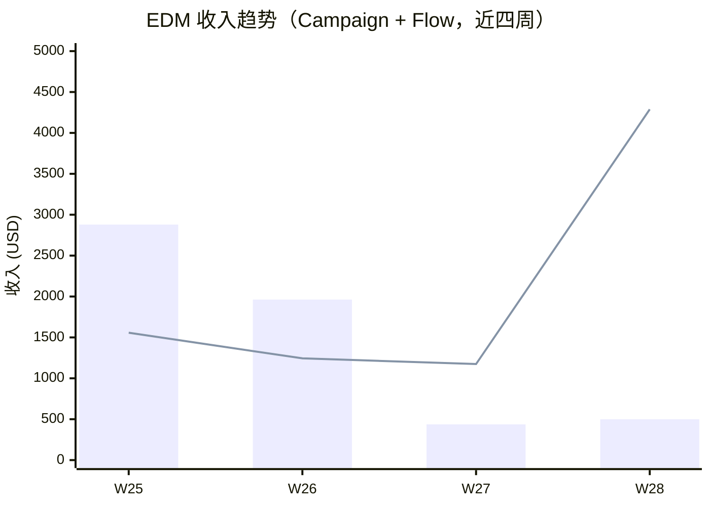
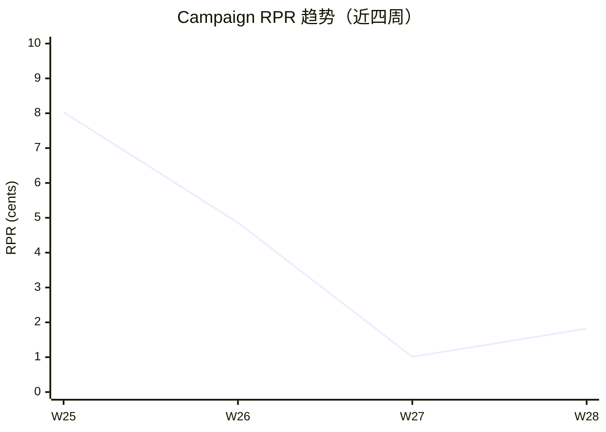

> 周窗口：2026-07-06 ~ 2026-07-12（ISO Week 28）｜生成：2026-07-14 US/Eastern｜数据：Klaviyo（KH 独立账号）+ Shopify + 营销活动日历
> ⚠️ T+1 早读：Summer Sale 全量覆盖本周，EDM 归因数据为 T+1 口径（非完整 T+7），收入会随时间增加

# 一、核心要点

## 本周数据总结

1. **Summer Sale 完整覆盖 W28**，整店 GMV **$44,934**（WoW **+37.7%**，187 单）— 活动增量显著
2. **EDM 总收入 $4,787（WoW +197.1%）**，其中 Campaign $499、Flow $4,288，EDM 占整店 **10.7%**
3. **Browse Abandonment V2 爆发至 $3,295**（占 EDM 总收入 69%），WoW +2,434.6% — Summer Sale 期间高客单用户被召回转化
4. **Post-Purchase Followup 连续 3 周零转化**（W26-W28），触达 323 人无任何收入贡献 — 须立即整改
5. **Campaign 打开率优秀（48.9%-51.8%）但 CTR 仅 0.20%-0.34%** — 内容引导点击不足，Summer Sale 促销邮件未能充分利用折扣吸引转化

## 营销活动背景

| 活动 | 类型 | 周期 | 本周状态 | 活动 GMV 目标 |
|------|------|------|----------|-------------|
| Summer Sale | Sales | 7/5 ~ 7/19（15天） | 完整覆盖 W28（7天） | $125,000 |

Summer Sale 第二周（W28）数据完全在活动窗口内。整店 $44,934 GMV 反映活动良好势头，但距 $125K 目标仍需后半程持续发力（当前完成约 36%）。W27（6/29-7/5）= Summer Sale 启动前基线周，W28 = 活动完整覆盖第一整周。两周差异几乎全部由活动拉动解释。

## 收入快照

| 指标 | W28 | W27 | WoW |
|-----|-----|-----|-----|
| EDM 总收入（Email） | **$4,787** | $1,611 | **+197.1%** |
| — Campaign 收入 | **$499** | $437 | +14.2% |
| — Email Flow 收入 | **$4,288** | $1,174 | **+265.2%** |
| Campaign 发送量 | 2 封 | 2 封 | 持平 |
| Campaign 总收件人 | 27,373 | 43,182 | -36.6% |
| Campaign RPR（均值） | $0.018 | $0.010 | +80.0% |
| Flow RPR（加权） | $5.67 | $3.33 | +70.3% |
| 整店 GMV（Shopify） | $44,934 | $32,629 | +37.7% |
| EDM 占整店收入比 | 10.7% | 4.9% | +5.8pp |

> EDM 占比较 W27 翻倍以上，反映自动化流程在活动期间的放大效应。整店增长 37.7% 主要由 Summer Sale 活动驱动。

## 近四周趋势

> 蓝柱 = Campaign 收入，折线 = Flow 收入。W28 Flow 收入飙升至 $4,288（历史最高），主要由 Browse Abandonment V2 在 Summer Sale 期间驱动。Campaign 收入低位企稳。

> RPR $0.018 较 W27 回升 80%，但仍大幅低于 W25 促销峰值 $0.080。两封促销邮件 CTR 极低，内容引导不足。

---

# 二、数据诊断与行动建议

## 2.1 Campaign 活动邮件

### 行业基准

| 指标 | 基准区间 | 适用类型 |
|------|---------|---------|
| 打开率 | 25-55% | Activewear/Gymnastics DTC |
| 点击率 | 0.5-2.0% | 高客单品类 |
| CTOR | 1.0-3.0% | 通用 |
| CVR | 0.05-0.15% | 购买决策周期长的品类 |
| 退订率 | 0.1-0.3% | 健康区间 |
| 退信率 | 0.3-1.0% | 需关注上限 |

### 本周发送邮件数据

| 邮件名称 | 发送日 | 受众 | 收件人 | 打开率 | 点击率 | CTOR | CVR | RPR | AOV | 收入 | 退订率 | 退信率 | Web View |
|---------|-------|------|--------|--------|--------|------|------|------|------|------|--------|--------|---------|
| 7.8 Create a Summer Play Space | 7/8 Wed | Engaged 180d Gymnastics | 9,335 | 48.93% 🟡 | 0.20% 🔴 | 0.42% 🔴 | 0.021% 🟡 | $0.030 🔴 | $138 | $276 | 0.09% 🟢 | 0.24% 🟢 | [预览](https://www.klaviyo.com/campaign/01KWXWN733AP3BQ3J9HP8XZKTP/web-view) |
| 7.11 Best sellers | 7/11 Sat | active 180d + Engaged 3d no purchase | 18,038 | **51.83%** 🟢 | 0.34% 🔴 | 0.65% 🔴 | 0.006% 🔴 | $0.012 🔴 | $223 | $223 | 0.14% 🟢 | 0.24% 🟢 | [预览](https://www.klaviyo.com/campaign/01KX5J1MBZ1T07FWKEEFCTR1RB/web-view) |

> ⚠️ **两封邮件 CTR 均低于行业基准下限（0.5%）**，打开率优秀但点击转化严重不足 — 邮件内容可能缺少醒目的 CTA 按钮和产品展示图。7.11 发送于周六，T+7 归因窗口截至 7/18，收入/CVR/RPR 仍在回填。

### 素材评分

| 邮件 | 标题行 | 预览文本 | 首屏 | CTA | Offer 清晰度 | 受众匹配 | 信息层级 | 总分/35 | 等级 |
|------|--------|---------|------|-----|-------------|---------|---------|---------|------|
| 7.8 Create a Summer Play Space | 4 | 4 | 3 | 2 | 3 | 3 | 3 | 22 | 🟡 |
| 7.11 Best sellers | 5 | 4 | 3 | 3 | 4 | 3 | 3 | 25 | 🟡 |

> 7.8 面向"Engaged 180d Gymnastics"分群（体操兴趣用户），主题为 Summer Play Space 场景化内容，CTR 0.20% 极低——场景化内容缺乏直接折扣引导。7.11 面向"active 180d + Engaged 3d no purchase"双分群，主题为 Best Sellers 热销推荐，CTR 0.34% 略好但仍低于基准。两封均未使用品类购买者分群（Strength/Tumbling/Balance/Mats）做个性化推荐。

### 问题与建议

**问题诊断表**

| # | 问题描述 | 根因 & 活动影响 | 优先级 | ETA |
|---|---------|---------------|--------|-----|
| 1 | Campaign 收入 $499 仍偏低，两封 Summer Sale 邮件合计仅 3 单转化 | 根因：CTR 仅 0.20%-0.34%，邮件缺少醒目 CTA 和产品展示图；两封均面向全量订阅者未做分层。活动影响：Summer Sale 期间 EDM 未能充分利用促销折扣驱动点击，错失流量转化 | **P0** | W29 |
| 2 | 仅发送 2 封 Campaign，Summer Sale 期间 EDM 频次不足 | 对比 W25 促销周 3 封 $2,880。W28 仅 2 封，且均面向同一全量池发送，未利用 KH 已有的品类分群做分层触达。活动目标 $125K 完成约 36% | **P1** | W29 |
| 3 | 7.11 Best sellers 主题为热销推荐但 CTR 仅 0.34%，1 单转化 | 产品推荐可能未精准匹配用户兴趣偏好，未利用 KH 品类购买者分群（Strength/Tumbling/Balance）做个性化推荐 | P2 | 持续 |

**行动清单**

| 完成 | 行动描述 | 问题# | 类型 | 优先级 | ETA |
|------|---------|-------|------|--------|-----|
| [] | W29 增加促销 Campaign 至 3 封，配合 Summer Sale 下半程冲刺 | #2 | 🟢 数据支撑 | **P0** | W29 |
| [] | 下周邮件利用 KH 品类分群（Strength/Tumbling/Balance/Mats Buyers）做分层发送，不再全量统一发送 | #1 #3 | 🟢 数据支撑 | **P1** | W29 |
| [] | 促销邮件模板增加产品展示图 + 折扣标签 + CTA 按钮 A/B 测试 | #1 | 🟡 推测假设 | P1 | 7.21 |
| [] | 对 30d 内活跃未购买用户分群发送专属折扣，提升 CVR | #1 | 🟢 数据支撑 | P2 | W29 |

---

## 2.2 自动化流程

### 核心流程数据

| 流程名 | W28 收入 | WoW | 总触达 | 转化数 | RPR（最高邮件） | 健康状态 |
|--------|---------|-----|--------|--------|----------------|---------|
| Browse Abandonment V2 | **$3,295** | **+2,434.6%** | 208 | 7 | $22.95（E2） | 🟢 正常（活动拉动） |
| Abandoned Cart V2 | **$647** | -38.0% | 152 | 5 | $14.91（E3） | 🟡 观察 |
| Welcome Series | **$346** | 新增 | 73 | 3 | $12.81（E1） | 🟢 恢复 |
| Post-Purchase Followup | **$0** | - | 323 | 0 | — | 🔴 异常 |
| Abandoned Cart (SMS) | $0 | - | 0 | 0 | — | ⚠️ 零发送 |
| Back In Stock | $0 | - | 0 | 0 | — | ⚠️ 零发送 |

**Browse Abandonment V2 邮件级明细（W28）：**
- E1 TzdaHt（第1封）：107 收件人，38.3% OR，4.67% CTR，1.87% CVR，2 转化，$977
- E2 XUhvft（第2封）：101 收件人，39.6% OR，2.97% CTR，3.96% CVR，5 转化，$2,318

> 两封邮件均产生转化，第2封 CVR 3.96% 且有 5 单 $2,318 — Summer Sale 期间浏览未购买用户在第二次触达时转化意愿大幅提升。

**Abandoned Cart V2 邮件级明细（W28）：**
- E1 XPiYXi（第1封）：100 收件人，37.8% OR，3.06% CTR，3.06% CVR，3 转化，$185
- E2 SwMQFF（第2封）：21 收件人，33.3% OR，4.76% CTR，0 转化
- E3 WUpb9Y（第3封）：31 收件人，45.2% OR，3.23% CTR，6.45% CVR，2 转化，$462

> 收入 $647 较 W27 $1,044 下降 38%，但触达量增加（152 vs 74）。第3封 CVR 6.45% 表现突出，说明第三封"最后机会"邮件在活动期间有效。

**Welcome Series 邮件级明细（W28）：**
- E1 T9Sfns（第1封 | 欢迎）：27 收件人，**77.8% OR**，18.52% CTR，11.11% CVR，3 转化，$346
- E2 TmiLgF（第2封 | 教育）：25 收件人，44.0% OR，0% CTR，0 转化
- E3 XQhQF2（第3封 | 推荐）：21 收件人，76.2% OR，4.76% CTR，0 转化

> 第1封转化 3 单 $346 — 新客在 Summer Sale 期间被 Welcome 邮件承接并立即转化。

**Post-Purchase Followup 邮件级明细（W28）：连续第 3 周零转化**
- E1 XSZqeV：198 收件人，47.0% OR，2.02% CTR，0 转化
- E2 VTSw54：109 收件人，61.1% OR，0.93% CTR，0 转化
- E3 WnfxNE：10 收件人，40.0% OR，0% CTR，0 转化
- E4 WtxNJ6：3 收件人，33.3% OR，0% CTR，0 转化
- E5 SQGMeY：2 收件人，100% OR，0% CTR，0 转化
- E6 XgGmE8：1 收件人，0% OR，0% CTR，0 转化

### 问题与建议

**问题诊断表**

| # | 问题描述 | 根因 & 活动影响 | 优先级 | ETA |
|---|---------|---------------|--------|-----|
| 1 | **Post-Purchase Followup 连续 3 周零转化**（W26-W28），本周触达 323 人收入 $0 | 根因：6 封邮件均为纯感谢/评分/信息确认，完全无交叉销售或复购引导；即使在 Summer Sale 期间仍未利用折扣促进复购 | **P0** | 7.16 |
| 2 | Browse Abandonment V2 效果极佳但依赖于活动本身 | 正常周召回较弱（W27 $130），W29 活动进入尾声后需关注 CVR 回落幅度 | P1 | W30 |
| 3 | SMS 双渠道连续零发送（Cart SMS + Back In Stock） | 订阅者基数小或触发条件未满足；Summer Sale 期间未利用 SMS 触达 | P2 | W29+ |

**行动清单**

| 完成 | 行动描述 | 问题# | 类型 | 优先级 | ETA |
|------|---------|-------|------|--------|-----|
| [] | **Post-Purchase Flow 第1封加入 Summer Sale 折扣引导**：嵌入"Summer Sale — Extra 15% Off Your Next Purchase"模块 | #1 | 🟢 数据支撑 | **P0** | 7.16 |
| [] | 监测 Browse Abandonment W29-W30 CVR 回落幅度，评估活动放大器系数 | #2 | 🟢 数据支撑 | P1 | 持续 |
| [] | 评估 SMS 订阅引导方案，Summer Sale 结算页增加 SMS opt-in 入口 | #3 | 🟡 推测假设 | P2 | W29+ |

---

## 2.3 订阅者

### 订阅者数据

| 指标 | 数值 | 备注 |
|------|------|------|
| 本周新增订阅人数 | ~304 | Klaviyo "Subscribed to Email Marketing" 事件计数 |
| Campaign 退订总数 | 32 | 退订率 0.12%（健康，<0.20% 阈值） |
| Campaign 退信 | 44 | 退信率 0.16%（极低） |
| 垃圾投诉 | 3 | 0.011%（正常） |
| 活跃分群 | 8 个 | Engaged 180d Gymnastics / High Intent Non-Purchasers / Strength Buyers / Tumbling Buyers / Balance Buyers / Mats Buyers 等 |

> 退订率 0.12% 在健康范围内。退信率 0.16% 极低，受众列表质量良好。KH 拥有精细化的品类购买者分群（Strength / Tumbling / Balance / Mats），为精准促销提供了受众基础。

### 问题与建议

**问题诊断表**

| # | 问题描述 | 根因 & 活动影响 | 优先级 | ETA |
|---|---------|---------------|--------|-----|
| 1 | 促销频次增加后需监控退订率 | W28 退订率 0.12% 正常，W29 增至 3 封/周后需设预警 >0.3% | P2 | 持续 |

**行动清单**

| 完成 | 行动描述 | 问题# | 类型 | 优先级 | ETA |
|------|---------|-------|------|--------|-----|
| [] | 设置退订率预警：单封邮件退订率 >0.3% 时暂停该受众分群后续发送 | #1 | 🟢 数据支撑 | P2 | W29 |

---

# 三、优先行动

## 本周 P0 待办

| 待办 | 负责方向 | KPI | ETA |
|------|---------|-----|-----|
| **Post-Purchase Flow 加入 Summer Sale 交叉销售模块**，第1封嵌入"Continue Shopping with 15% Off" | CRM | Flow 收入突破 $0（连续 3 周无转化不可接受） | **7.16** |
| W29 增加促销 Campaign 至 3 封，配合 Summer Sale 最后冲刺 | CRM | Campaign 收入 $1,500+ | **W29** |
| 利用 KH 品类购买者分群（Strength/Tumbling/Balance/Mats）做分层 Campaign 发送 | CRM | CTR 提升至 0.5%+ | **W29** |

## 下周计划（W29 / 7/13–7/19）

- Summer Sale 最后一周，集中 EDM 资源冲刺 $125K 目标剩余部分（当前完成约 36%）
- 关注 W29 活动结束后 Flow 数据回落幅度，评估 Summer Sale 对自动流程的放大器系数
- Browse Abandonment 效果突出，评估是否增加第3封邮件或调整折扣强度
- W28 Flow 数据在 T+7 窗口关闭后回填确认复查
- Monitor Post-Purchase Flow 修改后的首周效果

---

*报告由 AI CRM 运营系统自动生成 | KH CRM Weekly Performance Report - W28 | 下次更新: 2026-07-21 (W29)*
