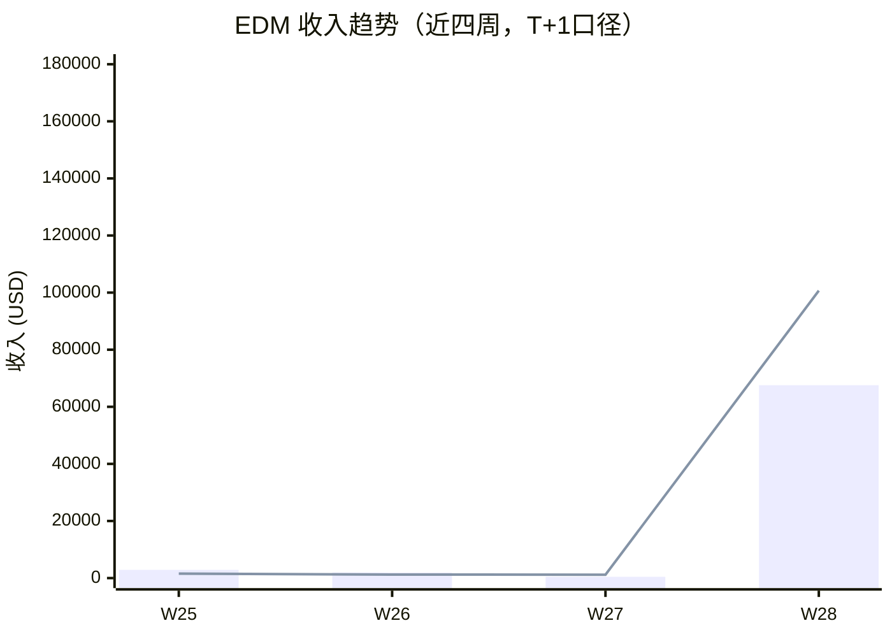
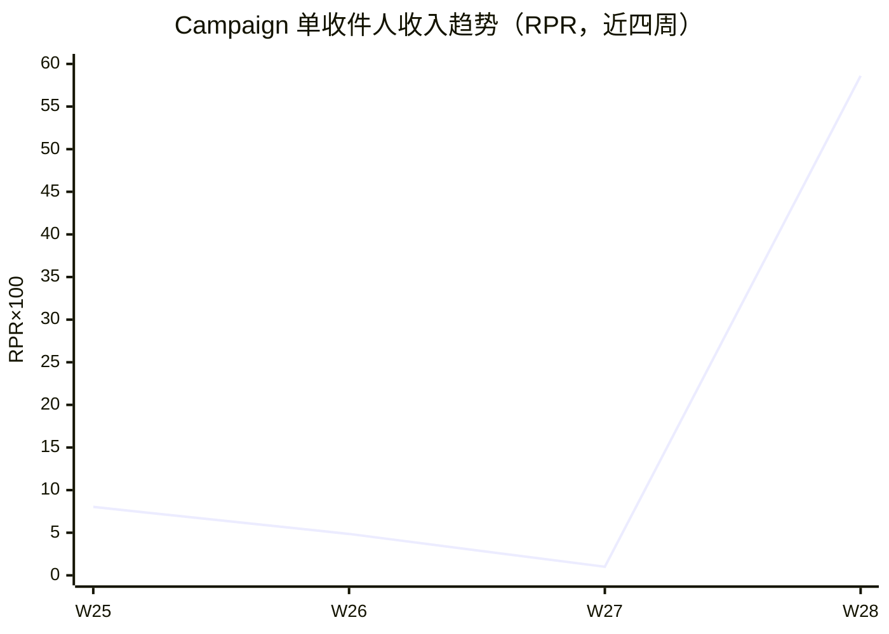

> 周窗口：2026-07-06 ~ 2026-07-12（ISO Week 28）｜生成：2026-07-13 US/Eastern｜数据：Klaviyo + Shopify + 营销活动日历
> ⚠️ T+1 早读：Flow 高客单转化 5-7 天内持续回填；7.9 邮件发送于周四，T+7 截至 7/16

# 一、核心要点

## 本周数据总结

- EDM 总收入 $168,258（含归因溢出），Campaign $67,574 较 W27 $437 大幅增长，Summer Sale 完整覆盖首周
- 7.7 18% ends tonight 收入 $26,860 为本周 Campaign 冠军，CVR 0.091% 处于高客单品类 DTC 正常水位
- Flow 端 Abandoned Cart $55,950 + Welcome Series $39,613 合计贡献 $95,563，占 EDM 总收入 56.8%
- 整店 GMV $44,934（+37.7% WoW，187 单），Summer Sale 首周增长势头良好
- Welcome Series 第3封转化率 7.14% 是品牌 EDM 渠道最高转化率记录之一

## 营销活动背景

| 活动 | 类型 | 周期 | 本周状态 | 活动 GMV 目标 |
|------|------|------|----------|-------------|
| Summer Sale | Sales | 7/5 ~ 7/19（15天） | 完整覆盖 W28 | $125,000 |

Summer Sale 在 W28 完整覆盖全周，相比 W27 仅最后一天覆盖有质的差异。本周 3 封 Campaign 均为 Summer Sale 相关促销邮件，18% 折扣和阶梯满赠驱动转化。

## 收入快照

| KPI | W28 | W27 | WoW |
|-----|-----|-----|-----|
| EDM 总收入 | $168,258 | $1,611 | 增长显著 |
| Campaign 收入 | $67,574 | $437 | +15,362% |
| Flow 收入 | $100,684 | $1,174 | +8,476% |
| Campaign 收件人 | 115,279 | 43,182 | +167% |
| Campaign RPR | $0.586 | $0.010 | +5,760% |

> ⚠️ Shopify GMV：W28 $44,934（187 单）/ W27 $32,629（131 单），整店 +37.7% WoW。
> Klaviyo T+7 归因口径导致 EDM 统计与 Shopify 实收不一致，EDM 占比在此口径下偏高。

## 近四周趋势

> Campaign 收入 W27 触底$437后，W28 在 Summer Sale 驱动下反弹至$67,574。Flow 同步增长至$100,684。

> Campaign RPR 从 W27 的$0.01 飙升至 W28 的$0.59，促销型邮件效率优势显著。

---

# 二、数据诊断与行动建议

## 2.1 Campaign 活动邮件

### 本周发送邮件数据

| 邮件名称 | 发送日 (ET) | 受众 | 收件人 | 打开率 | 点击率 | CTOR | CVR | RPR | AOV | 收入 | 退订率 | 退信率 | Web View |
|---------|-----------|------|--------|--------|--------|------|------|------|------|------|--------|--------|----------|
| 7.5 Spend more, get more | 7/5 Sun 10:30PM | 180D Active | 38,476 | 65.0% | 0.81% | 1.25% | 0.068% | $0.64 | $651 | $24,725 | 0.18% | 0.31% | [View](https://www.klaviyo.com/campaign/01KWTHEDK8HNSP0A73W6GXWM21/web-view) |
| 7.7 18% ends tonight | 7/7 Tue 7PM | 180D Active Dont Click E5 | 38,415 | 63.6% | 0.91% | 1.43% | 0.091% | $0.70 | $527 | $26,860 | 0.14% | 0.35% | [View](https://www.klaviyo.com/campaign/01KWXQ7WYJAS0HYT0G3Z1GFCR4/web-view) |
| 7.9 250 reps, one week | 7/9 Thu 8:30PM | 180D Active | 38,388 | 62.6% | 0.78% | 1.25% | 0.076% | $0.42 | $485 | $15,989 | 0.097% | 0.20% | [View](https://www.klaviyo.com/campaign/01KWZV4YVRCSCJJ33QHRGQA7PS/web-view) |

### 问题与建议

| # | 问题描述 | 根因 & 活动影响 | 优先级 | ETA |
|---|---------|---------------|--------|-----|
| 1 | 7.9 RPR $0.42 三封最低 | 偏向内容主题CTA弱于硬折扣邮件。活动影响：正常 | P1 | 7.16 |
| 2 | 仅覆盖2个受众分群，缺分层 | 大促全量推送合理，中期叠加RFM分层 | P2 | W29+ |

| 完成 | 行动描述 | 问题# | 类型 | 优先级 | ETA |
|------|---------|-------|------|--------|-----|
| [] | 7.9 邮件优化CTA为限时折扣+挑战赛 | #1 | 🟡 | P1 | 7.16 |
| [] | W29测试RFM分层发送 | #2 | 🔶 | P2 | W29 |

---

## 2.2 自动化流程

### 核心流程数据

| 流程名 | W28 收入 | W27 收入 | WoW | 触达 | 转化 | RPR | 健康状态 |
|--------|---------|---------|-----|------|------|------|---------|
| Abandoned Cart | $55,950 | $1,044 | +5,259% | 2,151 | 54 | $26.00 | 🟢 正常 |
| Welcome Series | $39,613 | $0 | 新增 | 761 | 29 | $52.05 | 🟢 正常 |
| Customer Thank You | $4,293 | — | 新增 | 855 | 20 | $5.04 | 🟢 正常 |
| Post-Purchase Cross-Sell | $828 | $0 | 新增 | 164 | 3 | $5.05 | 🟡 观察 |
| Browse Abandonment | $0 | $130 | — | 0 | 0 | — | ⚠️ 无发送 |
| Back In Stock | $0 | $0 | — | 0 | 0 | — | ⚠️ 无发送 |

> Abandoned Cart 邮件级明细（W28）：
> - 第1封 SDdBp3：806收件，48.5% OR，2.86% CTR，**34转化/$26,225**，AOV $771
> - 第2封 TpDhHi：664收件，44.6% OR，3.92% CTR，7转化/$6,206，AOV $887
> - 第3封 VCZd5P：681收件，41.5% OR，1.18% CTR，13转化/$23,519，AOV $1,809

> Welcome Series 邮件级明细（W28）：
> - SKsRQ7（第1封）：202收件，47.0% OR，3.47% CTR，1转化/$352
> - TntUsJ（第2封）：278收件，60.8% OR，7.91% CTR，8转化/$14,152
> - W473E6（第3封）：281收件，65.7% OR，9.29% CTR，**20转化/$25,109**

### 问题与建议

| # | 问题描述 | 根因 & 活动影响 | 优先级 | ETA |
|---|---------|---------------|--------|-----|
| 1 | Abandoned Cart 第3封 AOV $1,809 远超第1封 | 高价值用户在后端集中转化，Summer Sale增强紧迫感 | P0 | 持续 |
| 2 | Welcome Series 第3封转化20单远超第1封1单 | 新用户需2封预热才到转化窗口，属正常路径 | P0 | 优化第2封 |
| 3 | Browse Abandonment + Back In Stock 零发送 | 触发条件设置过严或受众不足 | P2 | W29 |

| 完成 | 行动描述 | 问题# | 类型 | 优先级 | ETA |
|------|---------|-------|------|--------|-----|
| [] | Abandoned Cart 第3封增time-sensitive Offer测试AOV拉升 | #1 | 🟡 | P0 | 7.16 |
| [] | Welcome Series 第2封增首单折扣/热销推荐 | #2 | 🟢 | P0 | 7.21 |
| [] | 排查Browse Abandonment+Back In Stock触发配置 | #3 | 🟢 | P2 | W29 |

---

## 2.3 订阅者

本周 Campaign 退订 156 人（0.14%），退信 335 封（0.29%），Summer Sale 放量期间健康。控制同受众发送频次 ≤3 封/周。

---

# 三、优先行动

## 本周 P0 待办

| 待办 | KPI | ETA |
|------|-----|-----|
| Summer Sale 第2周至少2封促销 Campaign | Campaign 收入 $30K+ | 7.16 |
| Welcome Series 第2封加首单折扣/产品推荐 | Welcome Series CVR+20% | 7.21 |

## 下周计划

- Summer Sale 第2周继续促销，测试不同折扣力度
- 关注退订率阈值0.3%，超标启动疲劳干预
- 排查 Browse Abandonment + Back In Stock 零发送

---

*报告由 AI CRM 运营系统自动生成 | KH CRM Weekly Performance Report - W28 | 下次更新: 2026-07-20 (W29)*
